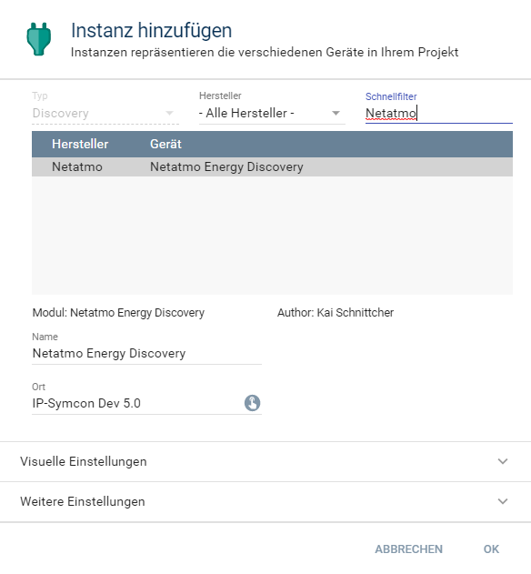
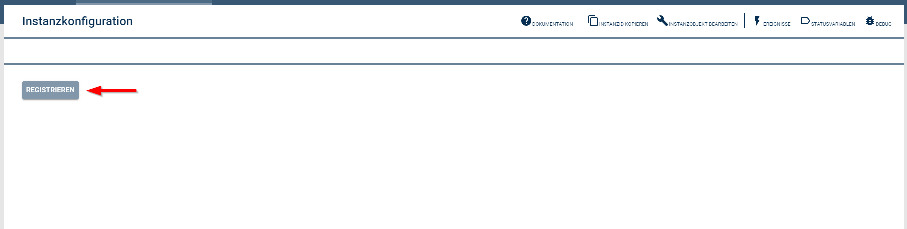
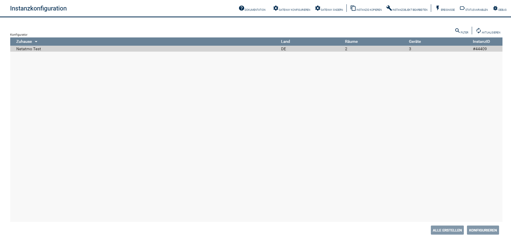
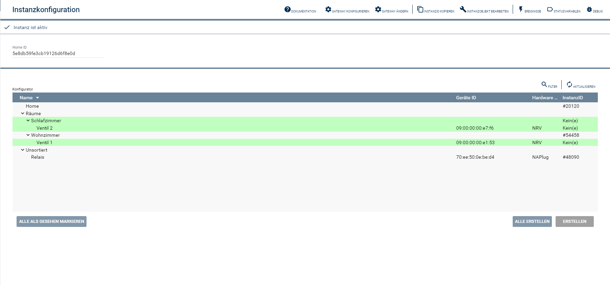
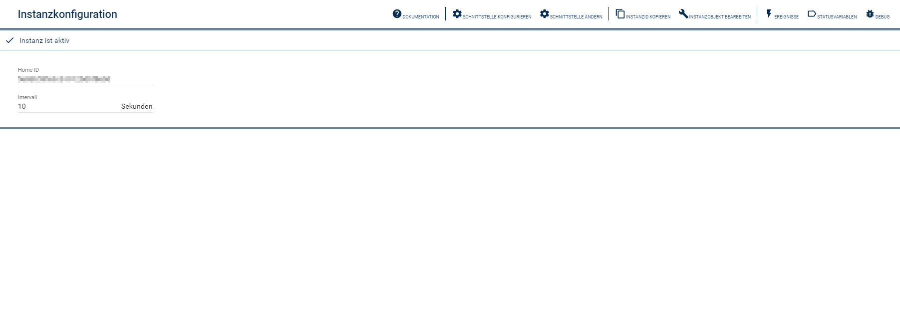

# NetatmoEnergy
   Dieses IP-Symcon Modul stellt eine Verbindung zu der Netatmo Energy Cloud her um Thermostate von Netatmo in IP-Symcon zu integrieren.
 
   ## Inhaltverzeichnis
   1. [Voraussetzungen](#1-voraussetzungen)
   2. [Enthaltene Module](#2-enthaltene-module)
   3. [Installation](#3-installation)
   4. [Konfiguration in IP-Symcon](#4-konfiguration-in-ip-symcon)
   5. [Spenden](#5-spenden)
   6. [Lizenz](#6-lizenz)
   
## 1. Voraussetzungen

* mindestens IPS Version 5.2
* eine gültige IP-Symcon Subscription

## 2. Enthaltene Module

* [Netatmo Energy Cloud](Netatmo Energy Cloud/README.md)
* [Netatmo Energy Device](Netatmo Energy Device/README.md)
* [Netatmo Energy Discovery](Netatmo Energy Discovery/README.md)
* [Netatmo Energy Home](Netatmo Energy Home/README.md)
* [Netatmo Energy Konfigurator](Netatmo Energy Konfigurator/README.md)
* [Netatmo Energy Room](Netatmo Energy Room/README.md)
* [Netatmo Energy Splitter](Netatmo Energy Splitter/README.md)

## 3. Installation
Installation über den IP-Symcon Module Store.

## 4. Konfiguration in IP-Symcon
Als erstes muss die Discovery Instanz erstellt werden.

Die Discovery Instanz erstellt die Netatmo Energy Cloud Instanz, innerhalb dieser Instanz muss die Verbindung zu der Netatmo Energy Cloud hergestellt werden.
Um Verbindung mit der Netatmo Energy Cloud herzustellen muss der Button "Registrieren" 
betätigt werden, daraufhin öffnet sich der Registrierungsprozess mit der Cloud.

Nach erfolgreicher Registrierung, werden in der Discovery Instanz alle Häuser angezeigt, welche mit dem Netatmo Account verknüpft sind.

Diese Häuser können über die Discovery Instanz angelegt werden, in IP-Symcon wird dann ein Konfigurator für das ausgewählte Haus angelegt.

Mithilfe des Konfigurators können die einzelnen Instanzen (Device, Room, Home) angelegt werden.

Innerhalb der Splitter Instanz kann eingestellt werden, in welchem Intervall der Status der Geräte / Räume abgefragt werden soll.

## 5. Spenden

Dieses Modul ist für die nicht kommerzielle Nutzung kostenlos, Schenkungen als Unterstützung für den Autor werden hier akzeptiert:    

## 6. Lizenz

[CC BY-NC-SA 4.0](https://creativecommons.org/licenses/by-nc-sa/4.0/)